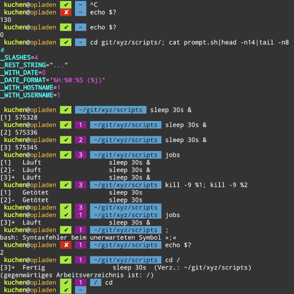

# kekse.biz
v3

.. that's the base version, as I guess my **kekse.biz** had at least(!) two prior versions before.
The real/full version of all the JavaScript's is available in the
[version.json](./blob/main/json/version.json).

## Preview
* https://kekse.biz/v3/test.html
* https://kekse.biz/v3/

## Documentation...
I will try to write down the API documentation for my .js modules in the 'docs/modules/' directory,
as markdown (.md).. until now here's only this general README.md, l8rs it'll be the [modules.md](./docs/modules/README.md).

## Configuration
A bit is still in a 'config.json' file, but the most parts are already integrated as "Custom CSS Properties" (which I'm accessing
via my `{document,element}.{get,set,has,*}Variable()` extensions. Take a look at the 'css/' path in here. :)~

Will be included in the documentation..

## scripts/

### prompt.sh


## Next steps

#### Responsible Design
That's how I want to design everything, to get it more 'responsible', too. Automatically align/size
everything, also for small, mobile web browsers..

The plan was to use a '*box*.js' (which is already there, btw), but planned to be used like regular
windows on your PC.. so that's not the final plan, as it's not so beautiful on mobile browsers. And
currently there are, btw, also '\*responsible\*.css', but they are going to be optimized as well.

#### Radix Sort and Radix conversions

#### Sort
As in JavaScript there's usually everything being sorted with the help of pure Integers (only real
floating point numbers - but they'll work here as well, due to their encoding..), the plan is to
use the 'best' sorting algorithm.

* https://codercorner.com/RadixSortRevisited.htm

#### Conversions
As already integrated in my [https://libjs.de/](lib[rary].js), the regular 36 radix maximum isn't
enough for me. It's even really useful that I'm supporting the 256 byte-code-radix (using all
the one-byte-characters)! :D~

Here's my current implementation (which is going to be ported to here!):
* https://libjs.de/lib/lib.js/ext/numeric.js

## Features / Modules

#### page.js, box.menu.js; ~home.
My pages are lying in the 'home/' directory and will be loaded (by the menu atm) by using a hash
'#~page'. This will show the contents of .txt and .html (animated, if wished) in the #MAIN element.

`<link> <script> <style>` elements will be extracted and created as DOM nodes; as it wasn't possible
for me to embed `<script>` (won't be executed, but '<' escaped). Such ressources can reside under the
'home/$page/' directory, and being embedded with '$CWD' (I'm altering the path for this relativity,
see also 'path.js' [verified path.normalize(), and it also works with URLs and their .pathname]);

Beware: only local scripts/styles can be loaded this way. Remote doesn't do anything (filtered out
this elements..) due to potential CORS attacks. :)~

And the menu bar is animated, and got some Math.sin() movement. ;)~

BTW: All LOCAL links will be inserted into the #MAIN element, without reloading the whole page (so
your pages should be only the `<body>` part ;)~ .. remote links are already opened in new tabs, as
`.target` attribute will automatically be set to `_blank`. AND if `.target` is defined, on the other
hand, the link will be loaded there nevertheless.. that's important if local sites with own header,
etc., or just outside the design. :)~

#### CSS
See `css.js` and `css.matrix.js`.. the first one is implementing the base, to handle CSS on my own
(I'll be using this as some 'pre-processor' or so in the future); it became necessary due to some
other extensions, like `..getVariable()` etc..

Whereas the `css.matrix.js` (to be finished, too) is there to help with the `transform()`-CSS-styles
and their encoding of the CSS functional styles like `scale{,X,Y}()` or `rotate{X,Y,Z}()`, etc..
atm the most important part is to recognize whether `rotate*` or `scale*` is enabled in the `matrix`
and `matrix3d` encoding value string of the `tranform` style..

I just did it by trying out and comparing the resulting matrices after changing these styles, .. in
the future there's going to be a real class for this, to handle any `transform` style with an
instance, so you can switch on/off them, etc.. ^_^

#### Scrolling / OSD (On Screen Display)
It's combined, but the 'box.osd.js' can be used everywhere. Looks like the volume meter on old CRTs
(non-flat TVs ;)~ .. fading/animating in/out, disappearing after some time, .. big font size, etc. :)~

#### Web Animations API
Extended the base functionality massively, and fixed some things that seem like bugs! See 'animation.js' (and it's still in progress).

#### Date
Extensions ready. .. including own format strings, and more. :)~
Has some templates for nice time/date formats, but also support '%*' modifiers to declare a format by hand.

##### ..format();

###### Single char modifiers
Beneath some more functions, these are only the real '%' modifiers for format strings.
I tried to make them one single char only, .. otherwise we could extend the list, but no..

| Modifier | Time component / value |
| :------: | ---------------------: |
| %D | .dayInYear() |
| %y | .getFullYear() |
| %m |  month |
| %d |  day |
| %k | .weekInYear |
| %H |  hours |
| %h |  hours (%12) |
| %M |  minutes |
| %S |  seconds |
| %s |  milliseconds |
| %X |  unix timestamp (ms/1000) |
| %t |  'am'/'pm' |
| %T |  'AM'/'PM' |
| %N |  Name of month |
| %n |  Short name of month |
| %W |  Name of weekday |
| %w |  Short name of weekday |

###### Pre-defined formats (see 'css/date.css');

```css
	--date-now: '%H:%M:%S.%s';
	--date-time: '%H:%M:%S';
	--date-date: '%y-%m-%d';
	--date-default: '%y-%m-%d (%H:%M:%S)';
	--date-best: '%y-%m-%d (%H:%M:%S.%s)';
	--date-console: '%y-%m-%d %H:%M:%S.%s';
	--date-full: '%W, %y-%m-%d (%H:%M:%S)';
	--date-text: '%W, %d. %N %y (%H:%M:%S)';
	--date-text-full: '%W, %d. %N %y (%H:%M:%S.%s)';
	--date-year: '%D (%w)';
	--date-ms: '%x';
	--date-unix: '%X';
	--date-gmt: auto;
```

#### Cookies
Some extensions to handle cookies better than via 'document.cookie' (manually coded)..

#### Popups
See 'box.popup.js'. Just set a string to the `.dataset.popup` of any HTML-Element, and it will magically be animated in/out/..
Including freeze mode/pause, better positioning, .. all (in the whole system!) with the modern 'Pointer Events API'.

#### Timing(.js)
Synchronized seconds, so many clocks (e.g.) will tick at the same time (so within a 1000ms threshold). You can manage multiple
timing elements, with some 'modulo'-argument to switch, e.g., every (%60) seconds. etc.

#### math.js / math.unit.js
Got some nice functions in here.

The 'math.unit.js' is for converting/parsing/rendering/.. file sizes or time durations, etc. It can convert size strings (MiB, mb,
..) to their byte count, or such to any size/unit (automatically recognized or manually defined). It can create a table{} of both,
absolute and relative parts of such numbers (like system/radix conversion), or render some times to a string/text form, or bring
them to a table{} form of absolute and/or relative [ day{,s}, month{,s}, minute{,s}, ... ].

Is being improved from time to time.

#### geo.js
ATM only distance calculation between two latitude/longitude values. Implemented *two* algorithms: 'haversine' and 'spherical law of
cosines'; output is either an object with all units in it, or (if defined) one of seven distance units.

#### levenshtein.js
Calculation of word distances, regularily used to suggest nearest commands from a wrong command input.. also supports case-insensitive.
Just define the input word plus a list of all available commands (if you don't use it for other reasons), maybe also max. two boolean
types (to define CASE_SENSITIVE or WITH_DISTANCES = [] result, not only the words).

## Links

### Library.js / lib.js
(Now) especially for the server-side, optimized to work with [Node.js](https://nodejs.org/).

* https://libjs.de/

See this web site with it's [Screenshots](https://libjs.de/#screenshots); you can also see there the
extensive use of ANSI Escape Sequences, they've got their own module [there](https://libjs.de/lib/lib.js/tty/ansi.js)
(whereas this is extended to the 'String' (atm also for the browser..));

BROWSER usage was integrated there, but I've came to the conclusion It'd be better do reduce it to
the server side. **This** here is the browser part, which I'll be using for my private website, soon. ^_^

For **one** reason: the library's _own_ `require()` is NOT async, as we need to wait for `module.exports`;
in the browser I already worked that way, but we had to preload the modules step by step.. this caused an
enormous latency! NOW I'm using just `<script>`-tags w/ `refer` enabled, so everything is loaded async;
thus: nearly NO delay! ;D~

### Bionic Reading
As this is just integrated in *my own implementation*, this is just to read a bit 'bout it (you can
see it when you click on a menu item, where the 'lorem ipsum' text appears. :)~

* https://www.heise.de/news/Bionic-Reading-Wie-eine-typografische-Methode-das-Web-lesbarer-machen-soll-7140358.html
* https://bionic-reading.com/

